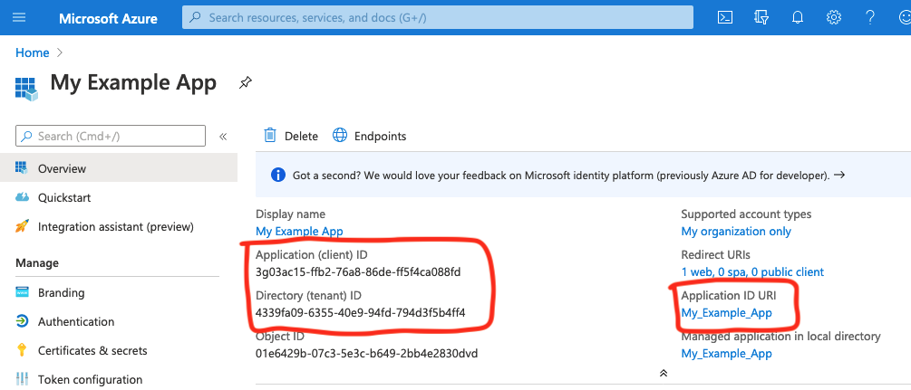

# GO SAML EXAMPLE
Example of SAML Sign-In in Go.

#### Disclaimer
_I'm not an expert on this field. I just figured out how to make it work for my needs and write down an example._

## Use the example

I needed to authenticate through a Federated Azure AD, so here is where I found the parameters:
 



Assuming you have your own parameters, set the environment variables properly and run:

``` bash
# install the dependencies first
go mod download  

TENANT_ID=3g03ac15-ffb2-76a8-86de-ff5f4ca088fd \
APP_ID=4339fa09-6355-40e9-94fd-794d3f5b4ff4 \
APP_ID_URI=My_Example_App \
go run ./src
```

and then open:

```
https://localhost:9090
```
